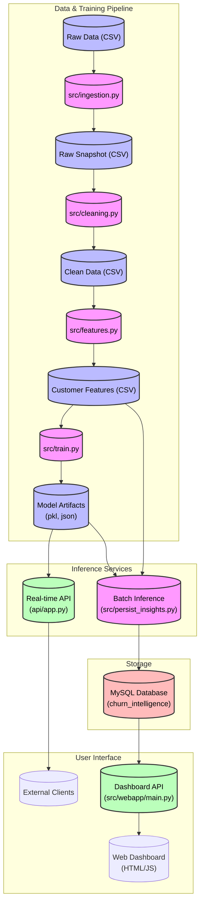

# 📊 Customer Churn & Revenue Optimization Intelligence System  
**End-to-End Data Science + Machine Learning + DevOps + Web Application**

> **Status:** 🚧 In Development |

A production-oriented decision intelligence system that predicts customer churn, quantifies revenue risk, and empowers business users. This project demonstrates a full lifecycle from raw data to deployed application, with ongoing enhancements for cloud and BI integration.

---

## 🔍 Problem Statement

Customer churn directly impacts revenue, but most organizations detect it **after** the loss occurs. This system answers three critical business questions:
1. **Who is likely to churn next?**  
2. **How much revenue is at risk due to churn?**  
3. **Which customers should be prioritized for retention?**

---

## 🎯 Solution Architecture

### High-Level Architecture

The system consists of three main subsystems:
1.  **Data & Training Pipeline**: Handles data ingestion, processing, feature engineering, and model training.
2.  **Inference Services**:
    -   **Real-time API**: Provides churn predictions for individual customers via REST API.
    -   **Batch Processing**: Generates insights and predictions for the entire customer base and stores them in a database.
3.  **Visualization**: A web dashboard to view business insights and churn metrics.

### Data Flow Diagram



### Component Details

#### 1. Data Processing Loop
-   **`src/ingestion.py`**: Loads raw data and saves a timestamped snapshot to ensure reproducibility.
-   **`src/cleaning.py`**: Cleans the data (handling missing values, duplicates, types) and produces `clean_customers.csv`.
-   **`src/features.py`**: Engineered features (e.g., `tenure_group`, `avg_monthly_spend`) are added, saving to `customer_features.csv`.

#### 2. Model Training
-   **`src/train.py`**:
    -   Loads feature data.
    -   Trains multiple models (Logistic Regression, Random Forest).
    -   Evaluates and selects the best model based on ROC-AUC.
    -   Saves the model (`churn_model.pkl`), scaler, and metadata to the `models/` directory.

#### 3. Real-time Inference (`api/`)
-   **`api/app.py`**: A FastAPI application.
    -   Loads the saved model artifacts on startup.
    -   Exposes a `/predict` endpoint that accepts customer data JSON and returns churn probability and risk level.
    -   Used for integrating churn prediction into other operational systems.

#### 4. Batch Insights & Dashboard (`src/`)
-   **`src/persist_insights.py`**: Runs predictions on the entire dataset.
    -   Calculates business KPIs (Expected Revenue Loss, Churn Rate).
    -   Stores predictions and KPIs into a **MySQL** database.
-   **`src/webapp/main.py`**: A FastAPI backend for the dashboard.
    -   Queries the MySQL database to serve KPIs, segment insights, and high-risk customer lists.
    -   Serves the static frontend (HTML/CSS/JS) for visualization.

### Infrastructure
-   **Docker**: The `docker-compose.yml` defines the `mysql` service and the `api` service.
-   **CI/CD**: `.github/workflows/data_pipeline.yml` runs automated tests on the API and model integration.

### Key Outputs
- **Churn Probability:** 0–100% risk score per customer.
- **Risk Segmentation:** Low / Medium / High risk buckets.
- **Revenue at Risk:** Quantified financial impact ($).
- **Priority Score:** Ranking metric to guide retention efforts.

---

## � Current Progress & Features

### ✅ Completed Modules
- [x] **Data Pipeline**: Ingestion, Cleaning, and Feature Engineering.
- [x] **Machine Learning**: Model training (Random Forest) and Evaluation.
- [x] **Database Integration**: MySQL storage for predictions and KPIs.
- [x] **API Development**: FastAPI backend for real-time inference.
- [x] **Web Dashboard**: Interactive HTML/CSS/JS frontend.
- [x] **Containerization**: Docker support for the API/Webapp.

### 🚧 Roadmap (Future Enhancements)

The following components are planned for integration in the near future to enhance scalability, automation, and visualization:

- [ ] **Cloud & Orchestration**:
    -   **AWS**: Full cloud deployment (EC2/EKS).
    -   **Kubernetes (K8s)**: Container orchestration for scaling the API and Webapp.
    -   **Ansible**: Configuration management for automated server provisioning.

- [ ] **Advanced CI/CD**:
    -   **Jenkins**: Robust pipeline automation for continuous integration and delivery.

- [ ] **Business Intelligence**:
    -   **Power BI Dashboard**: A comprehensive, interactive dashboard will be created for advanced data visualization and reporting.

---

## 📁 Project Structure

```text
DS-ML-DevOps/  
├── .github/workflows/    # CI/CD Pipelines
├── api/                  # Main Inference API
│   └── app.py            
├── data/                 # Raw and Processed Data
├── models/               # Serialized Models (pkl)
├── src/                  # Source Code
│   ├── webapp/           # Dashboard & Backend
│   │   ├── static/       # Frontend Assets
│   │   └── main.py       # Dashboard API
│   ├── business_insights.py
│   ├── ingestion.py
│   ├── persist_insights.py
│   └── train.py
├── Dockerfile            # Containerization
├── requirements.txt      # Dependencies
└── README.md             # Documentation
```

---

## 🧪 How to Run Locally

### Prerequisites
- Python 3.11+
- MySQL Server (running locally)

### 1. Setup Environment
```bash
pip install -r requirements.txt
pip install -r src/webapp/requirements.txt
```

### 2. Run the ML Pipeline
```bash
# Ingest, Clean, Train, and Persist Data
python src/ingestion.py
python src/train.py
python src/persist_insights.py
```

### 3. Start the Web Application
```bash
python -m uvicorn src.webapp.main:app --port 8000 --reload
```
Access the dashboard at: **http://127.0.0.1:8000/static/index.html**

---

## 💡 Why This Project?

- **Real Business Value:** Moves beyond accuracy metrics to financial impact.
- **Full-Stack Data Science:** Covers the entire lifecycle from data extraction to user-facing dashboard.
- **Scalable Design:** Built with microservices and containerization in mind.
